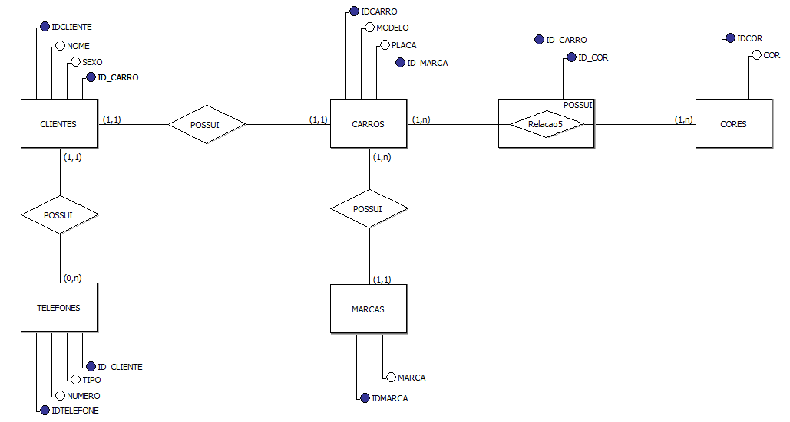

# Oficina do Sr. José

Este projeto tem como objetivo modernizar a oficina do Sr. José através do cadastro dos carros que entram para realizar serviços e seus respectivos donos. A modelagem lógica foi realizada utilizando o brModelo e a modelagem física foi implementada em SQL.

## Escopo do Projeto

- Cada cliente possui apenas um carro.
- Um carro possui uma marca.
- Um carro pode ter mais de uma cor.
- Os telefones dos clientes não são obrigatórios.

## Modelagem Lógica



## Script SQL

O script SQL a seguir foi utilizado para criar o banco de dados `OFICINA` e suas respectivas tabelas e relacionamentos.

```sql
CREATE DATABASE OFICINA;

USE OFICINA;

CREATE TABLE CLIENTES(
	IDCLIENTE INT PRIMARY KEY AUTO_INCREMENT,
	NOME VARCHAR(30) NOT NULL,
	SEXO ENUM('M','F') NOT NULL,
	ID_CARRO INT UNIQUE
);

CREATE TABLE TELEFONES(
	IDTELEFONE INT PRIMARY KEY AUTO_INCREMENT,
	TIPO ENUM('CEL','RES','COM') NOT NULL,
	NUMERO VARCHAR(30) NOT NULL,
	ID_CLIENTE INT
);

CREATE TABLE MARCAS(
	IDMARCA INT PRIMARY KEY AUTO_INCREMENT,
	MARCA VARCHAR(30) UNIQUE
);

CREATE TABLE CARROS(
	IDCARRO INT PRIMARY KEY AUTO_INCREMENT,
	MODELO VARCHAR(30) NOT NULL,
	PLACA VARCHAR(30) NOT NULL UNIQUE,
	ID_MARCA INT
);

CREATE TABLE CORES(
	IDCOR INT PRIMARY KEY AUTO_INCREMENT,
	COR VARCHAR(30) NOT NULL UNIQUE
);

CREATE TABLE CARROS_CORES(
	ID_CARRO INT,
	ID_COR INT,
	PRIMARY KEY(ID_CARRO,ID_COR)
);

ALTER TABLE TELEFONES ADD CONSTRAINT FK_TELEFONES_CLIENTES
FOREIGN KEY (ID_CLIENTE) REFERENCES CLIENTES(IDCLIENTE);

ALTER TABLE CLIENTES ADD CONSTRAINT FK_CLIENTES_CARROS
FOREIGN KEY (ID_CARRO) REFERENCES CARROS(IDCARRO);

ALTER TABLE CARROS ADD CONSTRAINT FK_CARROS_MARCAS
FOREIGN KEY (ID_MARCA) REFERENCES MARCAS(IDMARCA);

ALTER TABLE CARROS_CORES ADD CONSTRAINT FK_CARROS
FOREIGN KEY (ID_CARRO) REFERENCES CARROS(IDCARRO);

ALTER TABLE CARROS_CORES ADD CONSTRAINT FK_COR
FOREIGN KEY (ID_COR) REFERENCES CORES(IDCOR);
